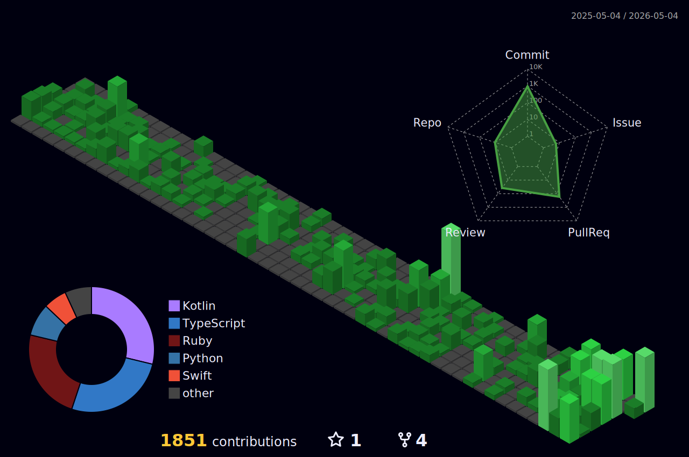

## 📊 My Status

  <table>
    <tr>
      <td>
        <h3>GitHub Metrics</h3>
        
      </td>
      <td>
        <h3>📈 Language Details</h3>
        
      </td>
    </tr>
  </table>

  <h3>3D Contributions</h3>
  

