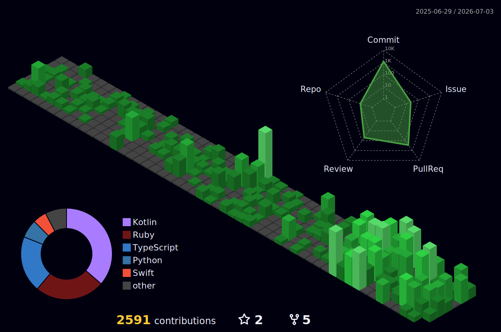

  <h2>Hi there, I'm Ryota Asai 👋</h2>

  <h3>🔗 Socials</h3>

  
  
  
  

  <h3>🛠️ Languages</h3>

  
  
  
  
  

  <h3>📦 Frameworks &amp; Libraries</h3>

  
  
  
  
  
  

  <h3>🧰 Tools</h3>

  
  
  
  

 

  <table border="0" width="100%">
    <tr>
      <td width="50%" align="center" valign="top">
        <h3>📊 GitHub Metrics</h3>
        
      </td>
      <td width="50%" align="center" valign="top">
        <h3>📈 Language Details</h3>
        
      </td>
    </tr>
  </table>

 

  <h3>🧊 3D Contributions</h3>
  <picture>
    <source media="(prefers-color-scheme: dark)" srcset="./profile-3d-contrib/profile-night-green.svg">
    <source media="(prefers-color-scheme: light)" srcset="./profile-3d-contrib/profile-green.svg">
    
  </picture>

 

  <table border="0" width="100%">
    <tr>
      <td width="50%" align="center" valign="top">
        <h3>💡 Coding Habits</h3>
        
      </td>
      <td width="50%" align="center" valign="top">
        <h3>🏅 Achievements</h3>
        
      </td>
    </tr>
  </table>

